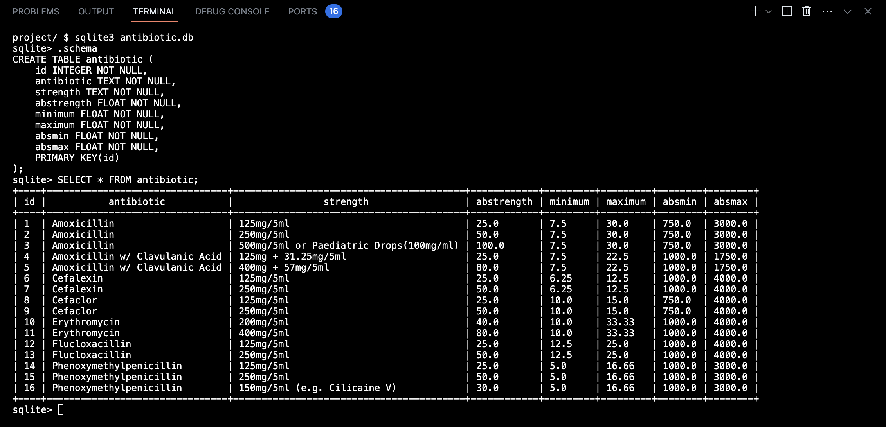

# Child Oral Antibiotic Dose Calculator
Child Oral Antibiotic Dose Calculator (COADC) is a dose calculator designed to be used by pharmacists or patients to verify the dosages of children antibiotic prescribed by their doctors.
### Video Demo:  <URL HERE>

### Motivation:
As pharmacists often have to take a long time to calculate children antibiotic dosee especially on a busy day, COADC is designed to speed up the process of verifying doctors' prescriptions while dispensing children antibiotic prescriptions.

### Tech/Framework used:
This project is built using primarily HTML5, CSS, Javascript. On top of that, this project is buit on Flask framework.

On the backend, the database is handled using SQLite which is imported from CS50 library.

Note about each columns in the antibiotic table:
* **ANTIBIOTIC**: This column lists all the **antibiotics**.
* **STRENGTH (mg/5ml)**: This column lists all the **strengths** available for each antibiotic (based on the local availabilities in Australia).
* **ABSTRENGTH (mg/ml)**: This column lists the strength in mg/ml unit.
* **MINIMUM (mg/kg)**: This column lists the **minimum dose** in mg for a child per kilogram of body weight.
* **MAXIMUM (mg/kg)**: This column lists the **maximum dose** in mg for a child per kilogram of body weight.
* **ABSMIN (mg/day)**: This column lists the **minimum daily dose** in mg for a child weighs 41 kilogram of body weight or less.
* **ABSMAX (mg/day)**: This column lists the **maximum daily dose** in mg for a child weighs more than 41 kilogram of body weight (average body weight for a 12-year-old). This means the child's weight is high enough to place him or her within the recommended adult range.

### How to use?
1. Select a specific antibiotic from the pull-down list.
2. Select a specific strength from the pull-down list.
3. Type the prescribed volume per dose into the input field.
4. Type the prescribed daily dose frequency into the input field.
5. Type the child's body weight into the input field.
6. Click "submit".
7. Results will show if the prescribed daily dose falls within the recommended daily dosage range.
8. Click on "start again" to restart any time along the process.

### Features:
* If the body weight is more than 41kg (which is the average body weight of a 12-year-old), that means that the child's weight is high enough to place him or her within the recommended adult range, the calculated values default to adult recommended values.
* COADC calculates the total prescribed daily dose as well the minimum and maximum recommended daily doses, and identifies whether the prescribed dose is low, high, or within the recommended range.

### Credits:
This project is inspired by a website called [Regional Locum](https://www.regionallocum.com.au/calculator). The antibiotic dosage data is supported by Australian Medicines Handbook (AMH).
